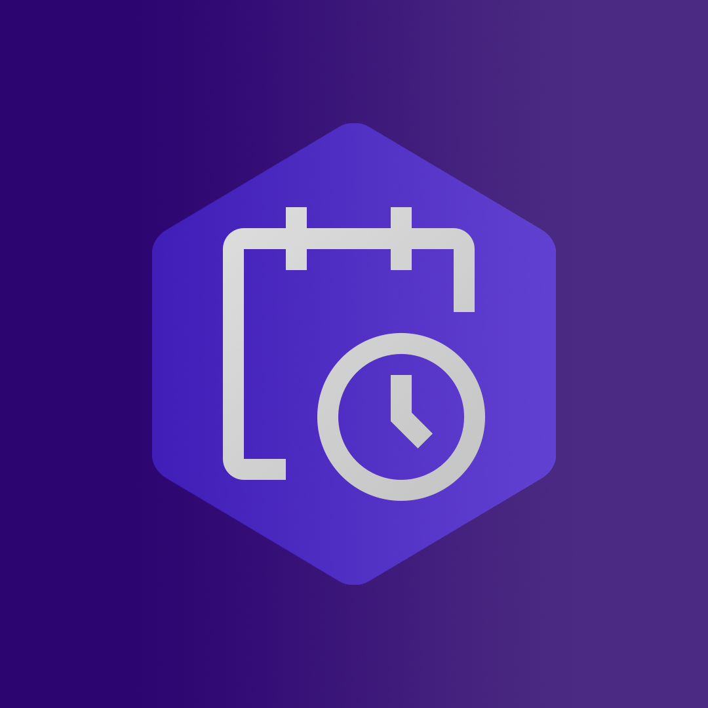
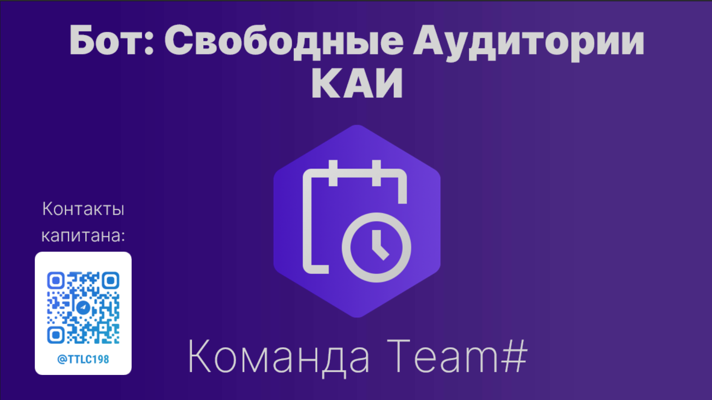

# KAIFreeAudiencesBot

Телеграм бот для отображения свободных аудиторий в зданиях КАИ.
## Stack
* ASP.NET 6.0, C# 8.0
* sqlite3
* python 3.6+
* nginx
* ngrok(for debug only)
* docker-compose
## Banner

## Docs

- [Deployment instructions](docs/deployment.md)
- [Parser commands](docs/parser.md)
